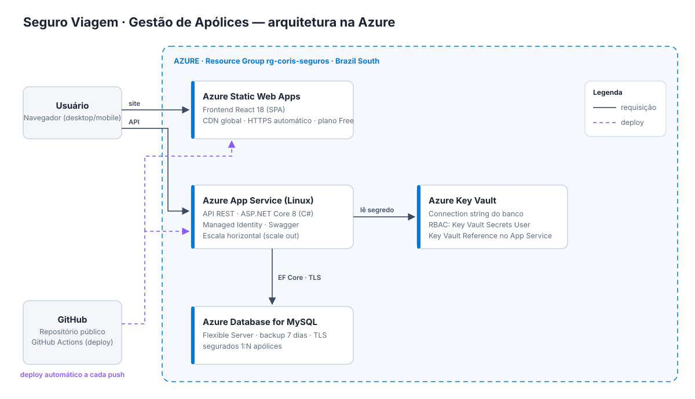

# Seguro Viagem - Gestão de Apólices (.NET)

Seguro Viagem é uma aplicação web para **gestão de apólices de seguro viagem**, desenvolvida como teste técnico, utilizando **ASP.NET Core 8 (C#)**, **React 18** e **MySQL**, com desenho de solução na **Azure**. O foco foi entregar o CRUD completo com as regras do negócio de seguros (cálculo do prêmio, vigência, exclusão lógica), com o código separado em camadas seguindo **SOLID** e **Clean Code** e testes automatizados.

---

## Requisitos atendidos

- Leitura, cadastro, edição e exclusão de apólices
- Backend em **.NET (C#)** com **ASP.NET Core 8** e **Entity Framework Core**
- Frontend em **React 18**
- Banco de dados relacional (**MySQL**) com relacionamento **1:N**
- Conceitos de **SOLID** e **Clean Code** (Controller, Service e Calculadora separados)
- Desenho de solução com componentes da **Azure**
- Testes automatizados (xUnit)
- Docker para desenvolvimento local

---

## Tecnologias

- **Backend:** ASP.NET Core 8 Web API (C#), Entity Framework Core, Swagger
- **Frontend:** React 18 + Vite + React Router
- **Banco:** MySQL 8 (provider Pomelo)
- **Testes:** xUnit + banco em memória do EF Core
- **Docker:** MySQL, API .NET e Nginx servindo o React
- **Azure:** App Service, Static Web Apps, Database for MySQL e Key Vault

---

## Desenho da solução



- **Static Web Apps** hospeda o React (estático, em CDN, com HTTPS)
- **App Service (Linux)** roda a API .NET
- **Azure Database for MySQL** guarda segurados e apólices
- **Key Vault** guarda a connection string do banco, lida pelo App Service com **Managed Identity**
- **GitHub Actions** faz o deploy a cada push

---

## Modelagem do Domínio

- **Segurado** → possui muitas **Apólices** (1:N). É identificado pelo CPF e reaproveitado entre apólices
- **Apólice** → pertence a um **Segurado**, tem destino, plano, vigência, prêmio e status (ativa ou cancelada)

---

## Regras de negócio

- **Prêmio** = diária do plano × dias de viagem × % do destino × % da idade do segurado
  - Planos: Essencial (R$ 12,90/dia), Plus (R$ 24,90/dia), Premium (R$ 39,90/dia)
  - Destino: Nacional 50%, América do Sul 100%, Europa 130%, América do Norte 140%, Ásia/África/Oceania 150%
  - Idade no início da viagem: até 59 anos 100%, 60 a 74 anos 160%, 75+ anos 250%
- Valores em dinheiro são guardados em **centavos (int)**, nunca em `double`, para não ter erro de arredondamento
- No cadastro a vigência não pode começar antes de hoje, e tem no máximo 365 dias
- CPF validado pelos dígitos verificadores
- A exclusão é **lógica**: a apólice recebe a data em `ExcluidoEm` e some do sistema, mas o registro fica no banco

---

## Fluxo

1. Operador cadastra uma **Apólice**.
   - O prêmio é calculado em tempo real enquanto o formulário é preenchido (endpoint de cotação).
   - Se o CPF já existir, o **Segurado** é reaproveitado.
2. Consulta a lista com busca (nome, CPF, e-mail ou número), filtro por status e paginação.
3. Edita a apólice e o prêmio é recalculado.
4. Cancela ou reativa pelo status.
5. Exclui a apólice (exclusão lógica).

---

## Organização do backend

```
backend/
  CorisSeguros.Api/
    Program.cs              configuração (banco, injeção de dependência, Swagger, CORS)
    Controllers/            ApolicesController e OpcoesController
    Dtos/                   ApoliceRequest (com as validações), ApoliceResponse e respostas
    Models/                 Segurado, Apolice e Catalogo (planos, destinos e status)
    Data/                   AppDbContext, Migrations e DadosIniciais (exemplos)
    Services/               ApoliceService, ICalculadoraPremio e CalculadoraPremio
    Validacoes/             atributo [Cpf]
  CorisSeguros.Tests/       testes xUnit
```

- **S** - cada classe com uma responsabilidade: o DTO valida, o Controller só trata HTTP, o Service tem a regra e a Calculadora só calcula
- **O** - plano ou destino novo é só mais um item no `Catalogo`; outra regra de preço é outra classe que implementa `ICalculadoraPremio`
- **L / D** - o `ApoliceService` recebe a interface `ICalculadoraPremio` pelo construtor; a implementação é registrada no `Program.cs`
- **I** - a interface da calculadora tem um método só

---

## Testes Unitarios

```bash
cd backend
dotnet test
```

> Todos os testes estão passando

---

# Docker (modo principal)

> Pré-requisitos: Docker Desktop instalado e em execução.

A aplicação roda no Docker em **http://localhost:3000**

## 1) Subir os containers

```bash
docker compose up -d --build
```

Na subida a API cria as tabelas (migrations do EF Core) e, se o banco estiver vazio, cadastra 5 apólices de exemplo.

## 2) Acessar

- App: **http://localhost:3000**
- API (Swagger): **http://localhost:8000/swagger**

> Se precisar recriar o banco do zero: `docker compose down -v` e subir de novo.

---

## Setup local sem uso de Docker

Requisitos: .NET 8 SDK, Node.js 18+ e um MySQL rodando (pode ser só o do Docker: `docker compose up -d mysql`).

```bash
cd backend/CorisSeguros.Api
dotnet run
```

A connection string fica em `appsettings.json`. Em outro terminal:

```bash
cd frontend
npm install
npm run dev
```

- App: **http://localhost:5173**
- Swagger: **http://localhost:8000/swagger**

---

## Endpoints

- `GET /api/apolices?busca=&status=&pagina=` - lista paginada
- `GET /api/apolices/resumo` - totais para os cards da tela inicial
- `GET /api/apolices/{id}` - detalhe
- `POST /api/apolices` - cadastra
- `PUT /api/apolices/{id}` - edita
- `DELETE /api/apolices/{id}` - exclusão lógica
- `POST /api/apolices/cotacao` - calcula o prêmio sem salvar
- `GET /api/opcoes` - planos, destinos e status

Erros de validação voltam com status `400` e a mensagem por campo.

---

## Deploy na Azure

Feito pelo Portal da Azure, no Resource Group `rg-coris-seguros` (Brazil South).

1. **Azure Database for MySQL - Flexible Server**
   - Criar o servidor e o banco `coris_seguros`
   - Em *Networking*, liberar acesso para serviços do Azure
2. **App Service** (Linux, .NET 8)
   - Em *Environment variables* > *Connection strings*: `Padrao` com a conexão do MySQL (com `SslMode=Required`)
   - Em *Deployment Center*: conectar o GitHub (projeto `backend/CorisSeguros.Api`)
3. **Key Vault** (opcional)
   - Guardar a connection string e usar referência `@Microsoft.KeyVault(...)` no App Service, com Managed Identity
4. **Static Web App**
   - Conectar o GitHub, app location `frontend`, output `dist`
   - Variável de build `VITE_API_URL` com a URL do App Service + `/api`

---

## Próximos passos

- Autenticação de usuários (JWT)
- Endosso: registrar o histórico de cada alteração feita em uma apólice emitida
- Testes de integração da API
- Testes no frontend

---

## Autor do projeto - teste tecnico para CORIS

Carlos Guilherme Fontes Pereira
